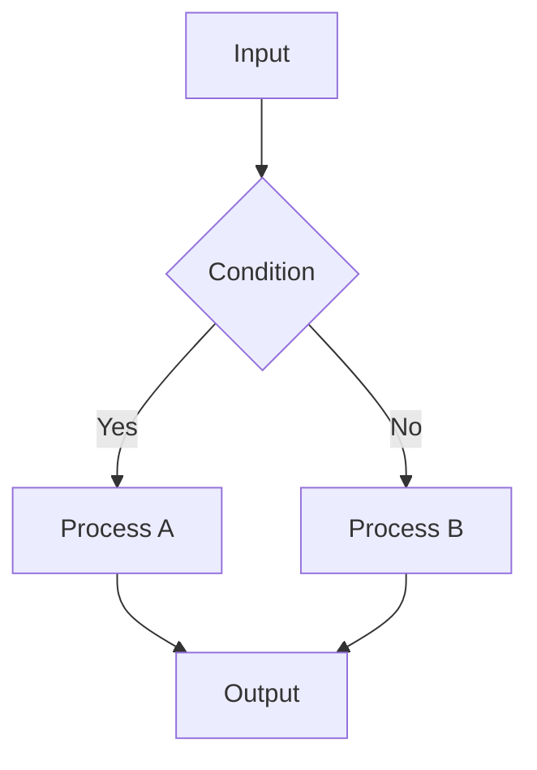

Explain the following code clearly with context and visual aids.

## Code to Explain

$ARGUMENTS

## Explanation Framework

### 1. **Overview First**
- What does this code do at a high level?
- What problem does it solve?
- Where does it fit in the codebase?

### 2. **Visual Representation**

Use Mermaid diagrams to show flow when helpful:



### 3. **Step-by-Step Breakdown**
- Break complex logic into numbered steps
- Explain each step in plain language
- Highlight non-obvious parts
- Explain the *why*, not just the *what*

### 4. **Key Concepts**
Identify and explain any advanced patterns used:
- Async/await patterns
- Design patterns (Observer, Factory, etc.)
- React patterns (custom hooks, composition)
- TypeScript generics or utility types

### 5. **Common Pitfalls**
Point out:
- Edge cases the code handles
- Potential gotchas
- Why certain decisions were made this way

### 6. **Practical Examples**
Show how to use the code with concrete examples:
```typescript
// How to call this function
const result = await exampleFunction({ param: 'value' })
```

## Output Format

1. **TL;DR** - One sentence summary
2. **Visual Diagram** - Mermaid flowchart or class diagram if applicable
3. **Step-by-Step Explanation** - Plain language breakdown
4. **Key Concepts** - Advanced patterns explained
5. **Usage Example** - How to use it in practice
6. **Potential Issues** - What to watch out for

Keep explanations accessible — assume the reader knows the basics but may not know this specific pattern.
